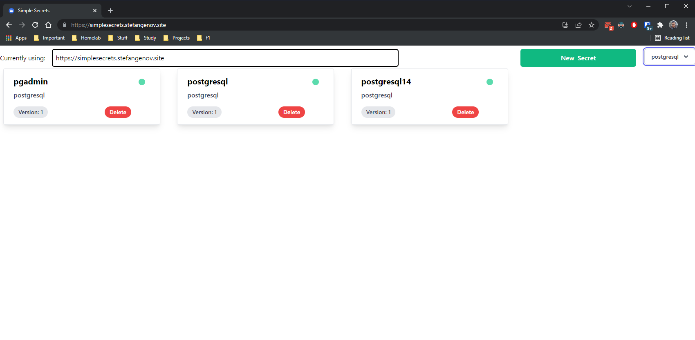
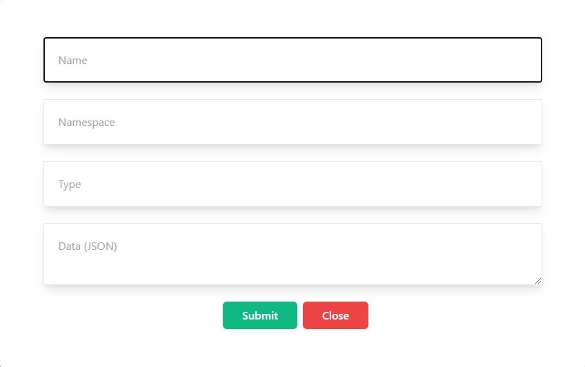
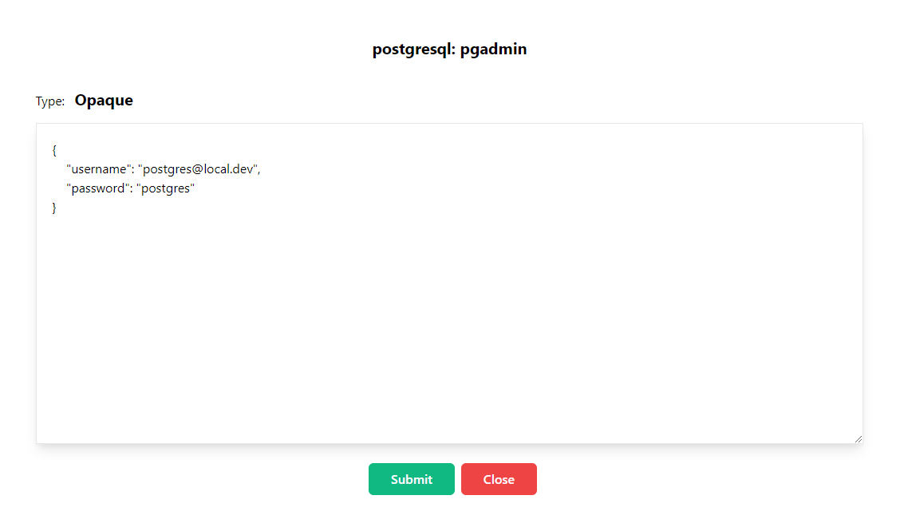
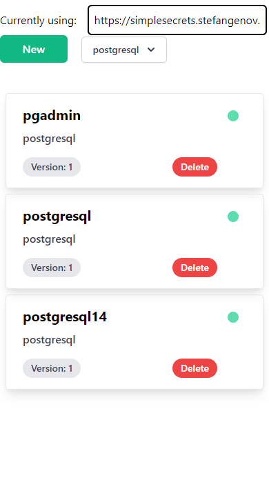

# Simple Secrets Frontend

A simple SPA PWA web app. Runs on port 3000.

When the app starts at the top you will be able to specify the URL to the simple secrets api, change it according to your distribution.

This is pretty much a static webpage that is being served, no persistent storage is needed. The url to be used will be stored in the local storage of the web browser.

## API backend:
https://github.com/Michaelpalacce/SimpleSecrets

## Screenshots
Home page:

Adding a new secret:

Updating an existing secret:

Mobile view:

## Docker image:
https://github.com/Michaelpalacce/SimpleSecretsFrontend

